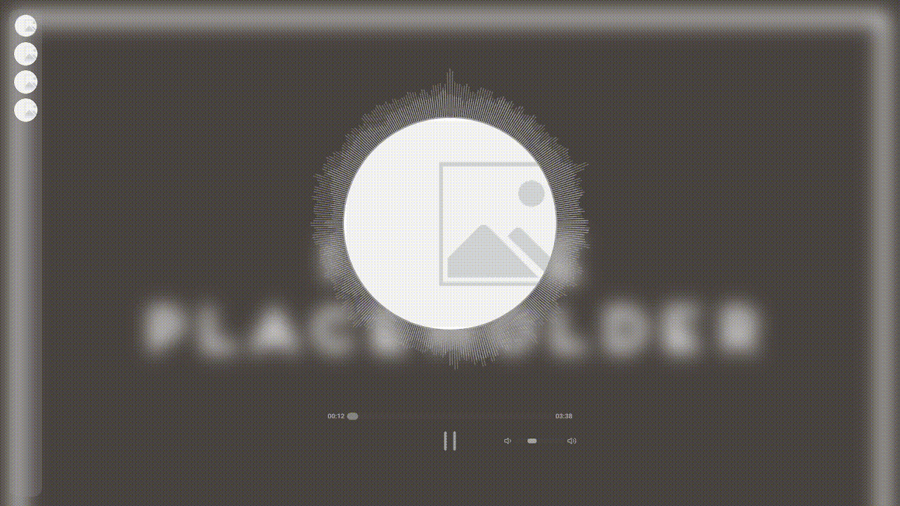

<h3 align="center">Audio Visualizer</h3>
<h3 align="center">[WIP]</h3>

  <p align="center">
    An awesome audio visualizer for your songs 
    <br />
    <a href="https://kasztancode.pl/AudioVisualizer">View Demo</a>
    ·
    <a href="https://github.com/KasztanCode/AudioVisualizer/issues">Report Bug</a>
    ·
    <a href="https://github.com/KasztanCode/AudioVisualizer/issues">Request Feature</a>
  </p>



## About The Project

Name is pretty self-explanatory, but it is a simple audio visualizing website.
I created it to learn techniques that will be used in some of my next projects.

### Built With

[![Angular][Angular.io]][Angular-url]

<p align="right">(<a href="#readme-top">back to top</a>)</p>

### Installation

1. Clone the repo
	 ```sh
	 git clone https://github.com/KasztanCode/AudioVisualizer.git
	 ```
2. Install NPM packages
	 ```sh
	 npm install
	 ```
3. add your song to songs array `song-selector.component.ts`
	 ```ts
	 {
			name:'Song',
			path: './assets/song.mp3',
			imagePath: './assets/songImage.jpg',
			backgroundPath: '../assets/backgroundImage.jpg'
		}
	 ```
4. build the app
5. ```sh 
		ng build
	 ```

<p align="right">(<a href="#readme-top">back to top</a>)</p>

## Contact

KasztanCode -  kasztangaming73@gmail.com

Project Link: [link](https://github.com/KasztanCode/AudioVisualizer)

<p align="right">(<a href="#readme-top">back to top</a>)</p>


[Angular.io]: https://img.shields.io/badge/Angular-DD0031?style=for-the-badge&logo=angular&logoColor=white
[Angular-url]: https://angular.io/
